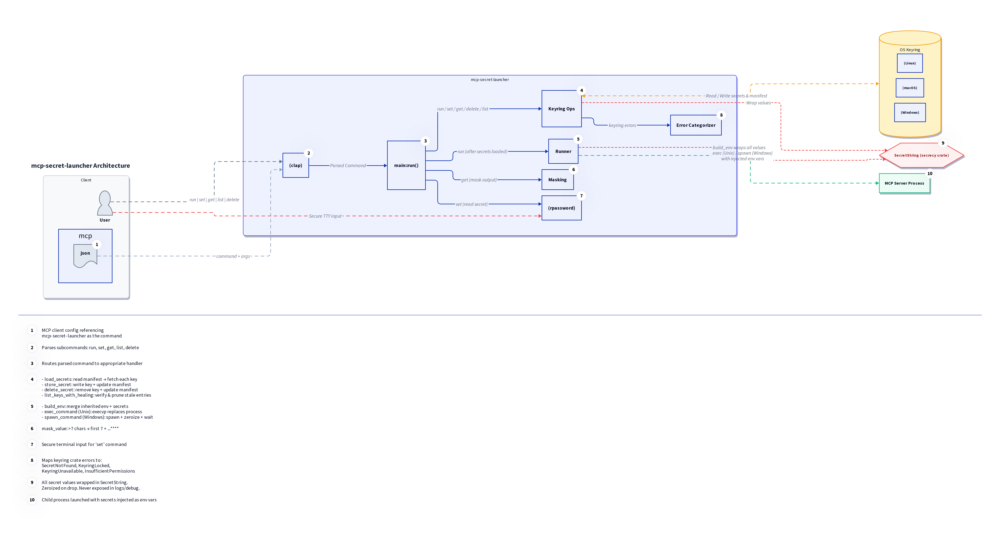
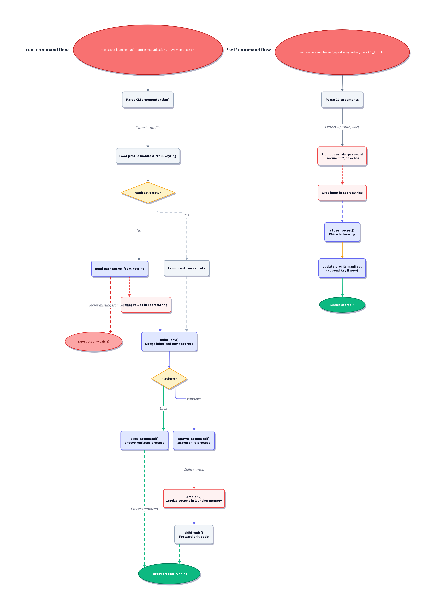

# mcp-secret-launcher

A lightweight Rust CLI that retrieves secrets from the OS keyring and launches MCP servers with those secrets injected as environment variables. No more plaintext API tokens in `mcp.json`.

## The Problem

MCP server configs (`~/.kiro/settings/mcp.json`) require API tokens in plaintext `env` blocks — visible to anyone with file access, easy to accidentally commit, and a violation of standard credential management practices.

## How It Works

1. Reads secrets from the native OS keyring (GNOME Keyring on Linux, Keychain on macOS, Credential Manager on Windows)
2. Injects them as environment variables in memory
3. Execs the target MCP server process — on Unix, the launcher replaces itself via `execvp` so it doesn't stay resident

### Architecture


### Execution Flow


## Prerequisites

### Linux (Ubuntu/Debian)

The Secret Service backend requires DBus development libraries:

```bash
sudo apt install -y libdbus-1-dev pkg-config
```

### macOS / Windows

No additional system dependencies required.

## Installation

```bash
cargo build --release
cp target/release/mcp-secret-launcher ~/.local/bin/
```

## Usage

### Store a secret

Secrets are entered via a secure, non-echoing prompt. They are never accepted as CLI arguments (no `--value` flag) to prevent leaking into shell history or logs.

```bash
mcp-secret-launcher set --profile mcp-atlassian --key JIRA_API_TOKEN
# Enter secret value: [hidden input]
```

### Verify a secret

```bash
mcp-secret-launcher get --profile mcp-atlassian --key JIRA_API_TOKEN
# JIRA_API_TOKEN = ATATT3x...****
```

### List keys for a profile

```bash
mcp-secret-launcher list --profile mcp-atlassian
# JIRA_API_TOKEN
# CONFLUENCE_TOKEN
```

### Launch an MCP server

```bash
mcp-secret-launcher run --profile mcp-atlassian -- uvx mcp-atlassian
```

### Delete a secret

```bash
mcp-secret-launcher delete --profile mcp-atlassian --key JIRA_API_TOKEN
```

## MCP JSON Integration

Drop-in replacement for the `command` field in your `mcp.json`:

```json
{
  "mcpServers": {
    "mcp-atlassian": {
      "command": "mcp-secret-launcher",
      "args": ["run", "--profile", "mcp-atlassian", "--", "uvx", "mcp-atlassian"],
      "env": {
        "JIRA_URL": "https://mycompany.atlassian.net",
        "JIRA_USERNAME": "user@example.com"
      }
    }
  }
}
```

Non-secret env vars stay in `mcp.json` as usual. The launcher merges them with keyring secrets, where keyring values take precedence on name collision.

## Platform Support

| Platform | Keyring Backend | Exec Behavior |
|----------|----------------|---------------|
| Linux | libsecret / Secret Service D-Bus | `execvp` (launcher replaced) |
| macOS | Security.framework / Keychain | `execvp` (launcher replaced) |
| Windows | Credential Manager | Spawn + wait + propagate exit code |

Linux requires a running keyring daemon (e.g., `gnome-keyring-daemon`, KeePassXC). Headless environments like Docker need explicit daemon configuration.

## Security

- Secrets never touch disk, logs, or stdout (except masked via `get`)
- All secret values wrapped in `secrecy::SecretString` with zeroize-on-drop
- No temporary files created at any point
- `set` uses non-echoing terminal input — no `--value` flag exists
- On Windows, the env map is explicitly dropped/zeroized before waiting on the child process
- Known limitation: on Linux, `/proc/[pid]/environ` exposes env vars to same-uid or root for the lifetime of the child process. This is an accepted tradeoff vs persistent plaintext files.

## Dependencies

| Crate | Purpose |
|-------|---------|
| `keyring` v3 | Cross-platform native keyring access |
| `clap` v4 | CLI argument parsing (derive) |
| `secrecy` v0.10 | Zeroize-on-drop secret wrappers |
| `rpassword` v5 | Secure non-echoing terminal prompts |
| `anyhow` | Error handling with context |
| `thiserror` | Structured error types |
| `serde_json` | Manifest serialization |

## Development

### Diagrams

If you modify the architecture or flow diagrams in `docs/`, you must regenerate the PNG files. This project uses [D2](https://d2lang.com/) and the ELK layout engine.

```bash
# Install D2 (if not already installed)
curl -fsSL https://d2lang.com/install.sh | sh -s --

# Generate PNGs
d2 --layout=elk docs/architecture.d2 docs/architecture.png
d2 --layout=elk docs/flow.d2 docs/flow.png
```

### Code Quality Checks

The project enforces strict code quality using `rustfmt` and `clippy`. You should run these checks before committing.

**To auto-fix formatting and some lints:**
```bash
# Auto-format code
cargo fmt

# Auto-fix clippy lints (where possible)
cargo clippy --fix --allow-dirty --allow-staged
```

**To check for formatting and lints (e.g., in CI):**
```bash
# Check formatting without modifying files
cargo fmt -- --check

# Check lints without fixing
cargo clippy --all-targets --all-features
```

### Running Tests

The project includes a comprehensive test suite. The test suite uses `proptest` for property-based testing and a `MockKeyring` backend so no real keyring interaction is needed during tests.

```bash
# Run all tests
cargo test

# Run a specific test suite
cargo test --test test_keyring_ops

# Run a specific test case
cargo test test_mock_keyring_set_and_get_secret

# Run tests with output printed to the console (useful for debugging)
cargo test -- --nocapture
```

### Building

```bash
# Build debug binary for development
cargo build

# Build release binary for production
cargo build --release
```

## License

This project is licensed under the MIT License - see the [LICENSE](LICENSE) file for details.
